# 🧠 Captain Cool — Multi-Agent IPL Match Strategist

> "Become the ultimate MS Dhoni. Leverage real-time Cricbuzz intelligence, advanced mathematical bowler resource models, and an agentic debate loop to make game-winning tactical decisions."

---

## ⚡ Features & Capabilities

* **📡 Live Cricbuzz Dual-Page Scraper**: Instantly pulls and merges real-time match details from both the active **Commentary** page (for live score, overs, wickets, active batters) and **Scorecard** page (for precise venue details, full rosters, playing XI, bench, and bowling statistics).
* **🤖 Multi-Agent Strategic Debate Loop**:
  * 📊 **Stats Analyst Agent**: Parses statistics, computes head-to-head records, evaluates live pitch conditions, and runs dedicated bowler resource audits.
  * 🧠 **Dhoni-Style Strategist Agent**: Proposes bold, high-impact tactical decisions (bowler choices, death over strategies, field sets, impact players).
  * 👹 **Devil's Advocate Agent**: Actively challenges proposals, stress-tests tactical calls under pressure, and exposes latent strategic flaws.
  * 🛡️ **Strategist Defense**: Re-evaluates the critiques, defends the core masterplan, or pivots dynamically to build a robust final plan.
  * 🎙️ **TV Commentator Agent**: Narrates the final tactical plan in a Harsha Bhogle-style broadcast voice to wow the user.
* **🛡️ Quota-Exhaustion Resiliency (Multi-Model Hot-Fallback)**: If `gemini-2.5-flash` hits daily free-tier limits, the orchestrator automatically swaps all agents to a **`gemini-flash-latest`** (Gemini 1.5 Flash) fallback on the fly, instantly hot-retrying requests for a completely lag-free user experience.
* **📈 Advanced Bowler Resource Model**: Computes remaining bowler resources by tracking overs bowled as exact ball values (e.g. `2.2` bowled = 14 balls) and subtracting them from the 4-over maximum (24 balls) to identify available death-bowlers and unbowled squad resources.
* **💎 Sleek Streamlit Dashboard**: A high-fidelity dark-themed interface showing the live scoreboard, automatic form-filling from Cricbuzz URLs, live tactical confidence metrics, and a beautiful step-by-step progress visualizer for the agent debate.

---

## 🏗️ Multi-Agent Architecture

```mermaid
graph TD
    A[Cricbuzz Match URL] -->|Dual-Page Scrape| B[MatchState Dataclass]
    B -->|Active Fields / Squads| C[Streamlit UI Form]
    C -->|🧠 Make Captain's Call| D[Orchestrator Debate Loop]
    
    subgraph Orchestrator [CaptainCoolOrchestrator]
        D -->|Step 1| E[Stats Analyst Agent]
        E -->|Stats Intelligence| F[Strategist Agent]
        F -->|Tactical Proposal| G[Devil's Advocate Agent]
        G -->|Critical Challenge| H[Strategist Defense]
        H -->|Final Tactical Call| I[Commentator Agent]
    end

    I -->|TV Broadcast Narrator| J[Harsha Bhogle Commentary Output]
    H -->|Calculate Similarities| K[Confidence Index %]
    
    style Orchestrator fill:#1e1e2e,stroke:#313244,stroke-width:2px
```



---

## 🛠️ Tech Stack & Dependencies

* **Core Language**: Python 3.10+
* **Framework**: Streamlit (Premium UI & Slider Controls)
* **LLM Client**: Google GenAI SDK (`google-genai` leveraging `gemini-2.5-flash` & `gemini-flash-latest` fallbacks)
* **Scraper**: BeautifulSoup4 & ScraperAPI (Dynamic Dual-Crawler)
* **Environment**: Dotenv (Local Keys Separation)

---

## 🚀 Getting Started

### 1. Clone the Repository
```bash
git clone https://github.com/your-username/captain-cool.git
cd captain-cool
```

### 2. Configure Environment Variables
Create a `.env` file in the root directory and add your credentials:
```ini
GEMINI_API_KEY="YOUR_GEMINI_API_KEY"
SCRAPERAPI_KEY="YOUR_SCRAPERAPI_KEY"
CRICAPI_KEY="YOUR_CRICAPI_KEY"
```

### 3. Install Dependencies
```bash
pip install -r requirements.txt
```

### 4. Run the Dashboard
```bash
streamlit run app.py
```
Open **`http://localhost:8501`** in your browser to start directing the match!

---

## 🔮 Strategic Debate Flow Example

```
📊 [Stats Analyst]
  - Target: 223 | Required Run Rate: 11.15 rpo | Balls Remaining: 120
  - Harpreet Brar has bowled 4.0 overs (0.0 remaining).
  - Lockie Ferguson has bowled 3.0 overs (1.0 remaining, economy: 14.30).
  - Wankhede Pitch is showing clear assistance for spin; dew factor is currently low.

🧠 [Strategist Proposal]
  - Dhoni's Call: Bowl Yuzvendra Chahal for the 18th over instead of Starc. Keep deep mid-wicket and long-on back. Use slow leg-breaks to tempt the batter into hitting against the spin.

👹 [Devil's Advocate Challenge]
  - Counter-Argument: Chahal's economy in the death overs has historically climbed to 11.5. If the batter gets underneath the leg-break, the short boundary at Wankhede makes this plan extremely high risk. Starc's yorkers represent a safer statistical play.

🛡️ [Strategist Defense]
  - Final Call: We stick with Chahal. The batsman has a historical vulnerability (strike-rate of only 95) against leg-spin in the first 5 balls of their innings. Starc's angles are better utilized to clean up the tail in the 19th and 20th.

🎙️ [TV Commentator]
  - "Oh, absolute magic! You can feel the tension here at the stadium! The captain is walking up to Chahal, handing him the ball. The fielders are moving. Dhoni is setting a trap, and the batsman has no idea what is coming! Let's see if this masterstroke secures the game!"
```

---

## 📝 License
Distributed under the MIT License. See `LICENSE` for more information.
# Agentic-Premier-League
# Agentic-Premier-League
